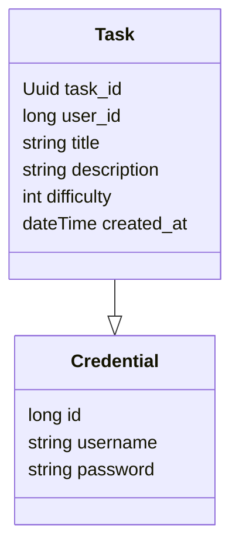
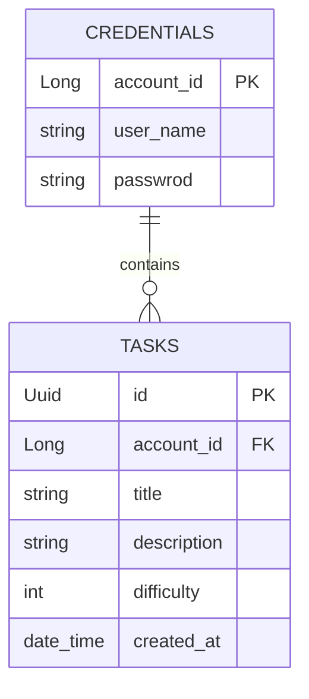
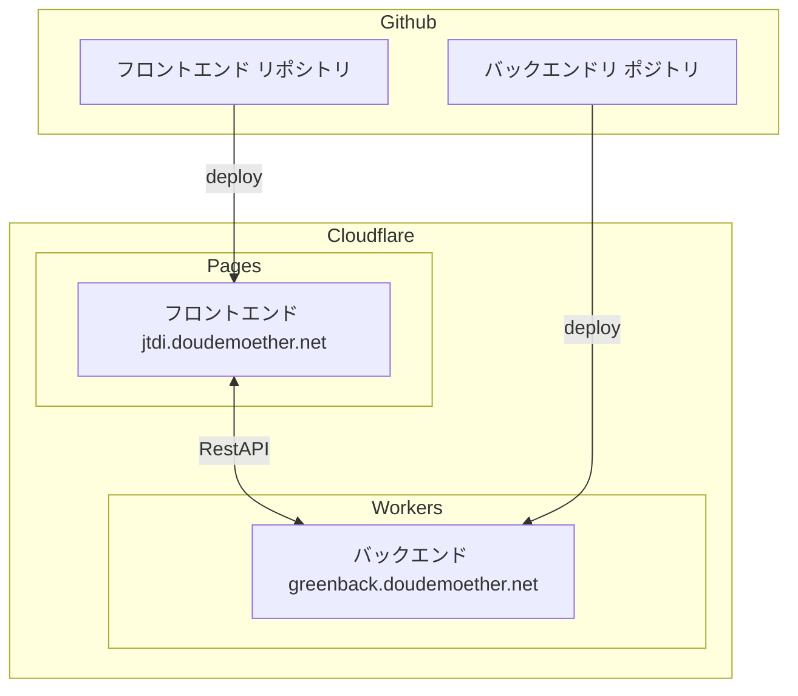

# greenback

Backend of JTDI

## DataStructure

```mermaid
classDiagram
class Credential {
	long id
	string username
	string password
}
class Task {
	Uuid task_id
	long user_id
	string title
	string description
	int difficulty
	dateTime created_at
}

Task--|>Credential
```

```mermaid
erDiagram
CREDENTIALS {
	Long account_id PK
	string user_name
	string passwrod
}
TASKS {
	Uuid id PK
	Long account_id FK
	string title
	string description
	int difficulty
	date_time created_at
}

CREDENTIALS ||--o{ TASKS: contains
```

```mermaid
flowchart TD

	subgraph Github
		repof[フロントエンド リポシトリ]
		repob[バックエンドリ ポジトリ]
	end
	subgraph Cloudflare
		subgraph Pages
			front[フロントエンド jtdi.doudemoether.net]
		end
		subgraph Workers
			back[バックエンド greenback.doudemoether.net]
		end
		front<-->|RestAPI|back
	end
	repof-->|deploy|front
	repob-->|deploy|back
```

## For Developpers

use `nix develop` or setup wrangler/rust manually
